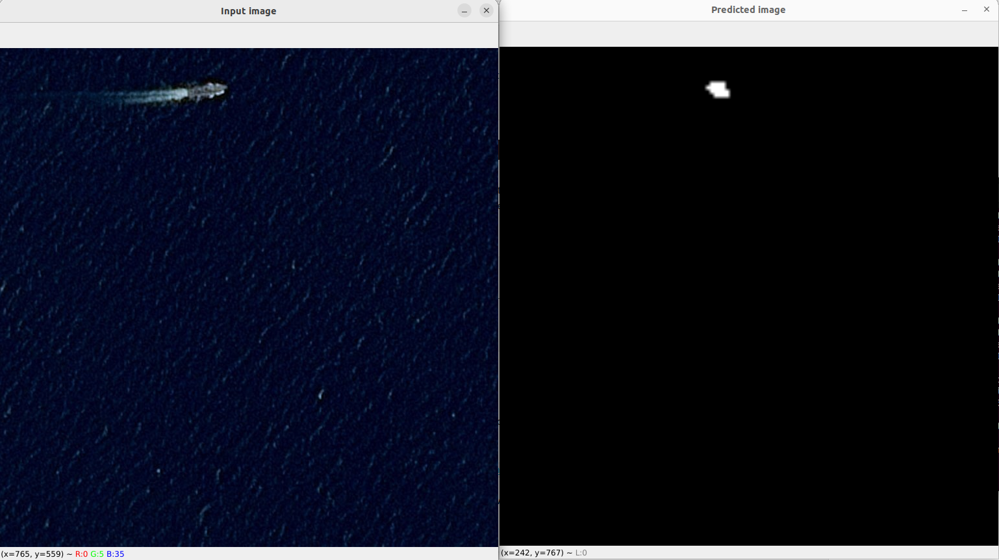
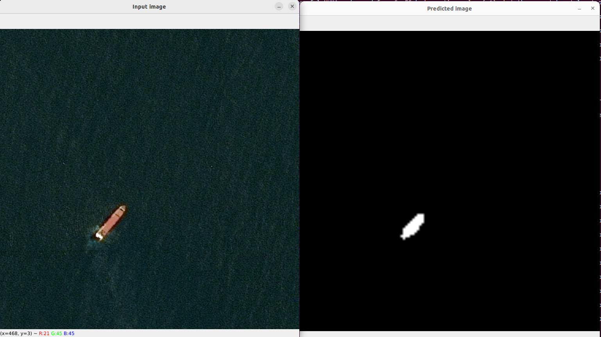

# winstars-ai-technical-task
Technical task received from Winstar.ai

This project focuses on semantic segmentation using computer vision techniques.

## Environment Setup

### Prerequisites

Make sure you have Python installed on your system. You can download it from [python.org](https://www.python.org/downloads/).

### Clone repository

```bash
git clone https://github.com/MarianPetlovanyi/winstars-ai-technical-task.git
```

### Open cloned repository folder

```bash
cd winstars-ai-technical-task
```


### Create a Virtual Environment

It's recommended to use a virtual environment to manage project dependencies. To create a virtual environment, open a terminal in the project directory and run:

```bash
python -m venv venv
```

### Activate Virtual Environment
On macOS/Linux:
```bash
source venv/bin/activate
```
On Windows:
```bash
venv\Scripts\activate
```

### Install Dependencies
Once the virtual environment is activated, install the required dependencies using the following command:
```bash
pip install -r requirements.txt
```

## Usage

### Download dataset(if you want to train model)
Once the virtual environment is activated and dependencies are installed, you can download dataset by using the following script:
```bash
python src/download_dataset.py
```
P.S. You can add `kaggle.json` file to root folder `winstars-ai-technical-task/` to enter Your credentials automatically

### Train the model
Once dataset is downloaded and unzipped, you can train a model by running script:
```bash
python src/train.py
```
P.S. this script support Hydra framework so you are free to modify it as you will:

Example:
```bash
python src/train.py model.input_size=[128,128,3]
```
You can check config file variables in `config/train.yaml`


### Demo
Recommended to ber runned from root directory. 
```bash
python inference.py
```
Result:


You can specify image path. Example:
```bash
python inference.py data.image_path=data/raw/airbus-ship-detection/test_v2/0b8cde107.jpg
```
Result:
